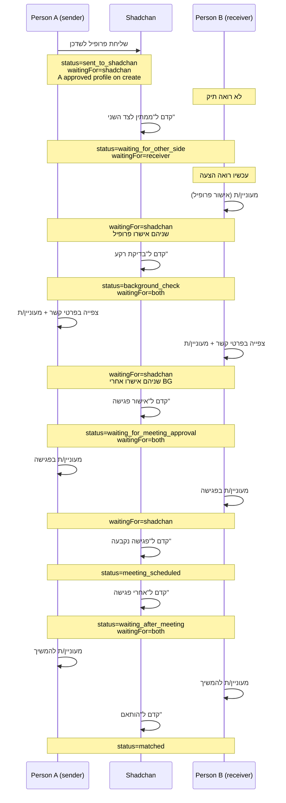
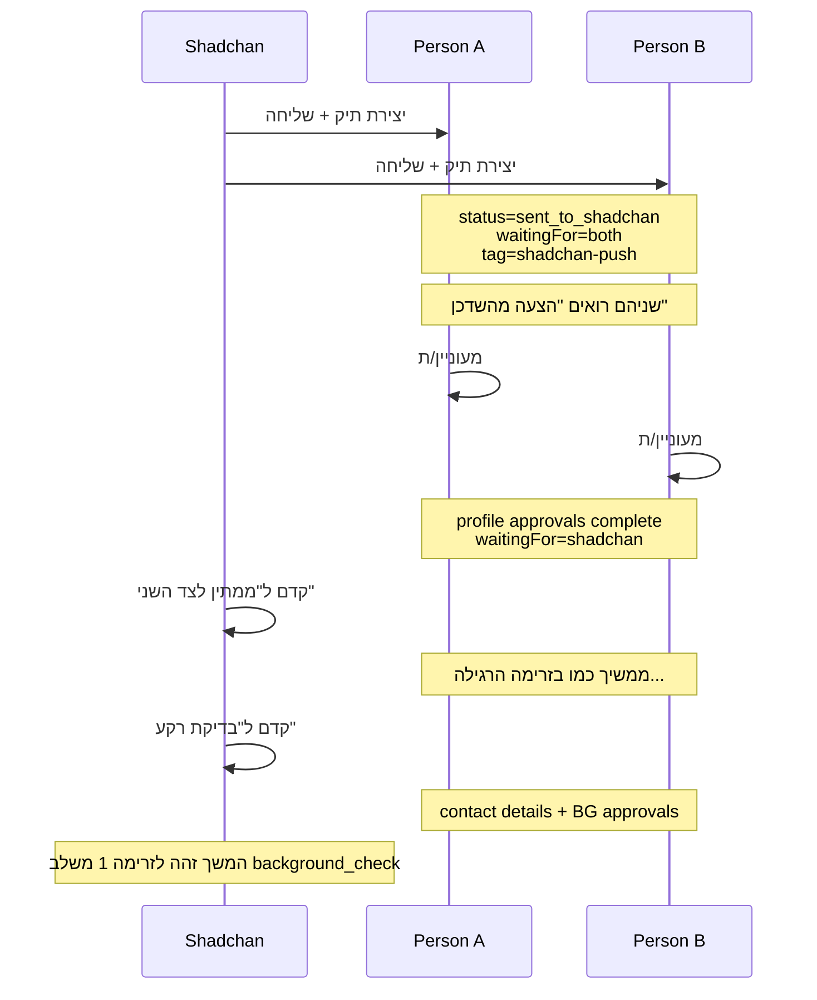
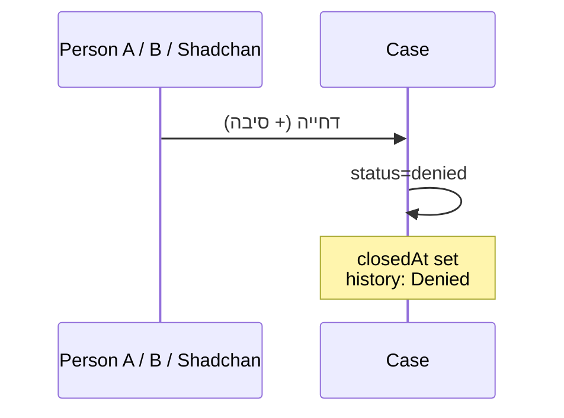

# Shidduch Workflow — Sequence Diagrams

מקור אמת: `backEnd/src/match-cases/constants/shidduch-workflow.ts`

---

## 1. בקשת משודך (Person A שולח לשדכן)

---

## 2. הצעת שדכן (shadchan-push)

---

## 3. דחייה (כל שלב פעיל)

---

## 4. מפת waitingFor

| waitingFor | משמעות | מי רואה "התור שלך" |
|------------|---------|---------------------|
| sender | Person A | Person A |
| receiver | Person B | Person B |
| both | שניהם | Person A + Person B |
| shadchan | השדכן | Shadchan (קדם לשלב הבא) |
| null | אין תור (למשל meeting_scheduled) | — |

---

## קבצים קשורים

- [shidduch-status-pipeline.csv](./shidduch-status-pipeline.csv) — מעברי שלבים
- [shidduch-stage-permissions.csv](./shidduch-stage-permissions.csv) — מטריצת הרשאות לפי שלב
